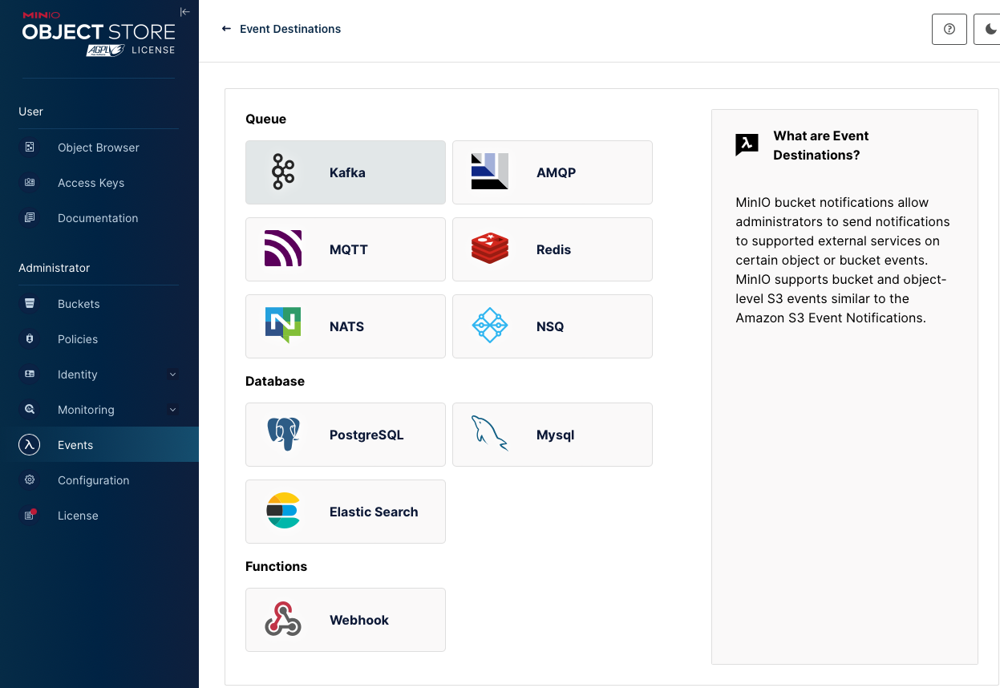
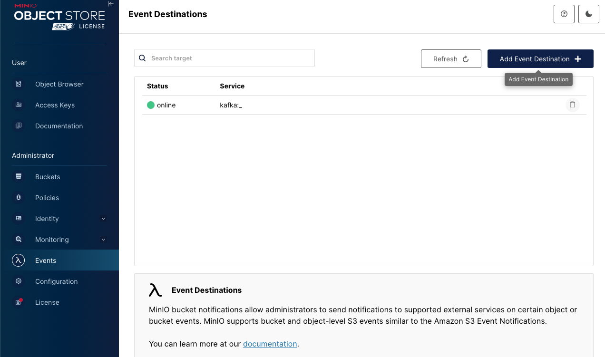
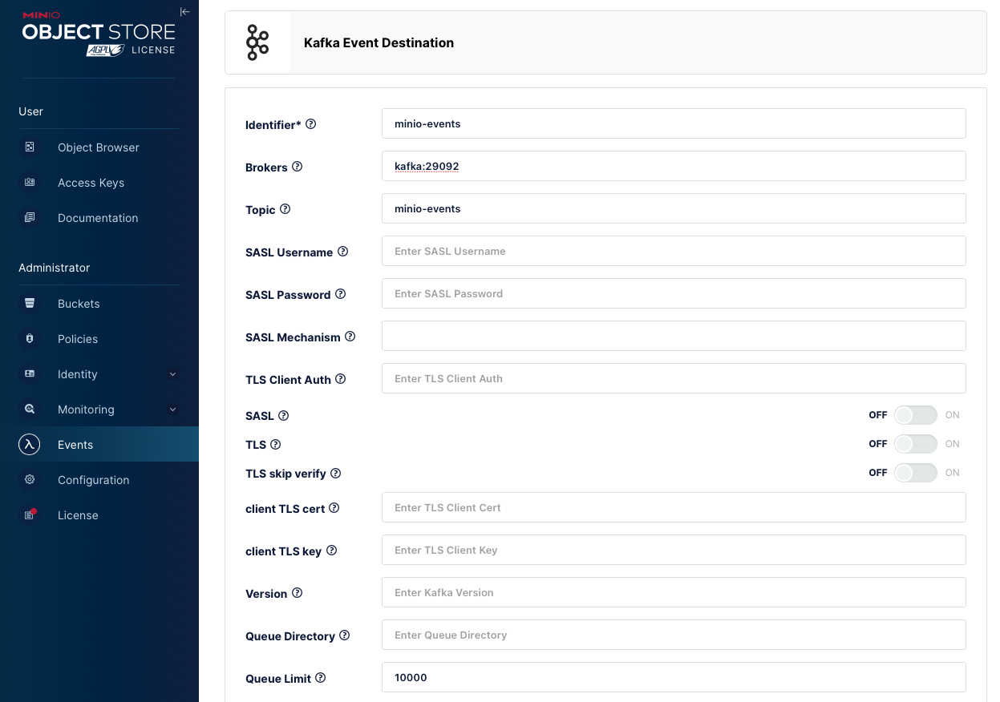
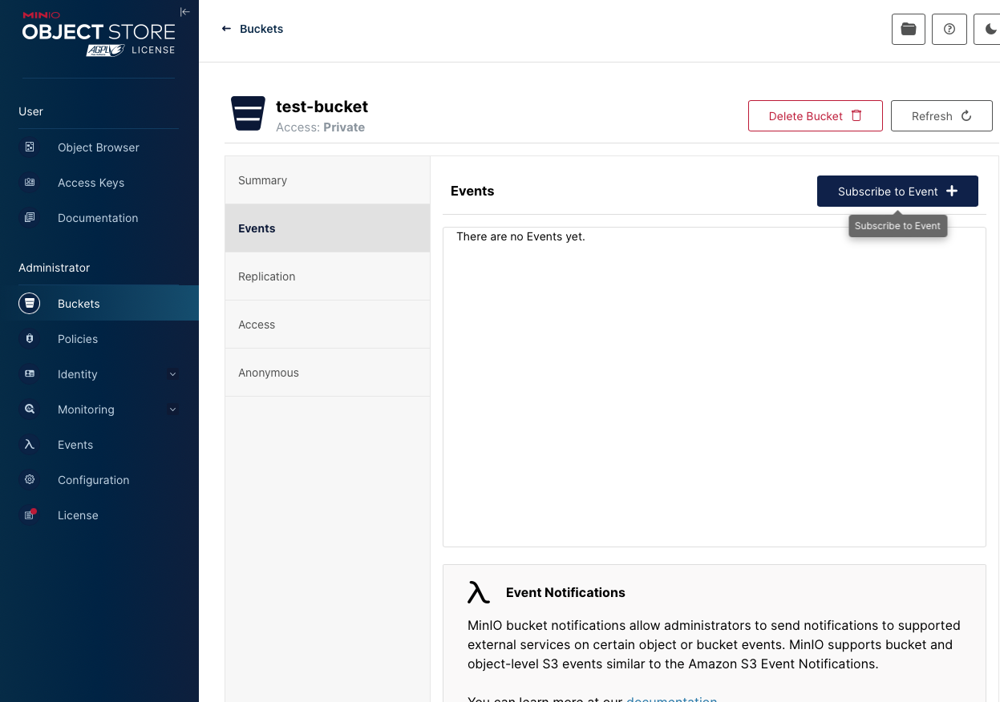
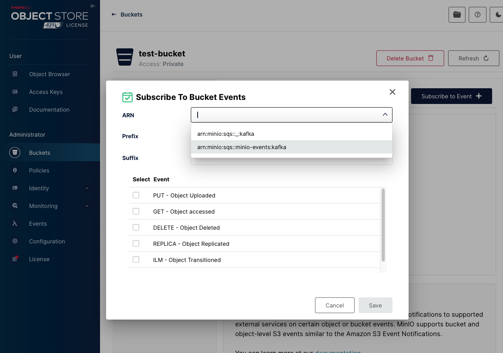
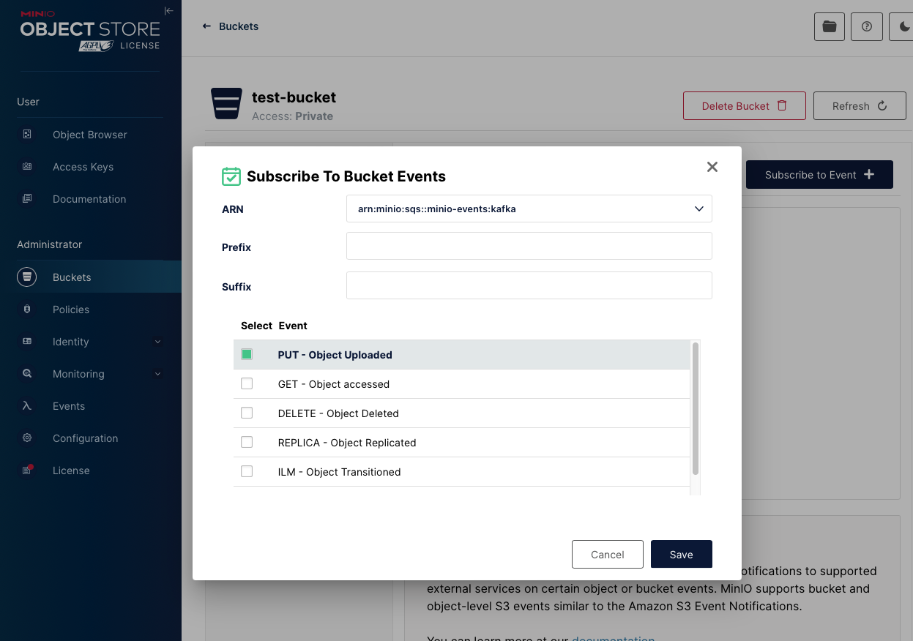

# MinIO 事件通知整合指南

本指南說明如何在 MinIO 中設定事件通知，以及如何配置儲存貯體（Bucket）的事件訂閱，並提供完整的實作範例。

## 目錄
- [前置需求](#前置需求)
- [專案架構](#專案架構)
- [快速開始](#快速開始)
- [支援的事件類型](#支援的事件類型)
- [支援的事件目標服務](#支援的事件目標服務)
- [系統配置說明](#系統配置說明)
- [程式碼範例](#程式碼範例)
- [事件格式說明](#事件格式說明)
- [監控和注意事項](#監控和注意事項)

## 前置需求

### 系統需求
- Python 3.7+
- Docker 和 Docker Compose
- MinIO 管理員權限
- 已設定並可訪問 Kafka 服務

### 相依套件
```
minio==7.2.0
kafka-python==2.0.2
confluent-kafka==2.3.0
```

## 專案架構
```
.
├── docker-compose.yml      # Docker 服務配置文件
├── requirements.txt        # Python 依賴套件
├── upload_2_minio.py      # MinIO 上傳測試程式
├── kafka_consumer.py      # Kafka 消費者程式
└── README.md              # 專案說明文件
```

## 快速開始

1. 啟動所有服務
```bash
docker-compose up -d
```

2. 安裝相依套件
```bash
pip install -r requirements.txt
```

3. 設定 MinIO 事件通知（透過 Web UI 或指令）

4. 執行測試程式
```bash
python kafka_consumer.py  # 啟動 Kafka 消費者
python upload_2_minio.py  # 測試檔案上傳
```

## 支援的事件類型
MinIO 支援以下儲存貯體和物件層級事件：
- PUT - 物件上傳
- GET - 物件訪問
- DELETE - 物件刪除
- REPLICA - 物件複製
- ILM - 物件生命週期轉換

## 支援的事件目標服務

| 服務類型 | 支援的服務 |
|----------|------------|
| 佇列系統 | - Kafka<br>- AMQP<br>- MQTT<br>- Redis<br>- NATS<br>- NSQ |
| 資料庫   | - PostgreSQL<br>- MySQL<br>- Elasticsearch |
| 功能     | - Webhook |




## 系統配置說明

### Docker 服務配置
```yaml
version: '3.7'
services:
  minio:
    environment:
      MINIO_ROOT_USER: minioadmin
      MINIO_ROOT_PASSWORD: minioadmin
      MINIO_NOTIFY_KAFKA_ENABLE: "on"
      MINIO_NOTIFY_KAFKA_BROKERS: "kafka:29092"
      MINIO_NOTIFY_KAFKA_TOPIC: "minio-events"
    ports:
      - "9000:9000"
      - "9001:9001"

  kafka:
    environment:
      KAFKA_BROKER_ID: 1
      KAFKA_ZOOKEEPER_CONNECT: zookeeper:2181
      KAFKA_ADVERTISED_LISTENERS: PLAINTEXT://kafka:29092,PLAINTEXT_HOST://localhost:9092
    ports:
      - "9092:9092"
```

### MinIO 事件通知設定步驟

1. 在 MinIO 控制台中導航到 Events 部分



2. 設定 Kafka 目標服務：
   - 識別碼（Identifier）：`minio-events`
   - 代理伺服器（Brokers）：`kafka:29092`
   - 主題（Topic）：`minio-events`
   - 佇列限制（Queue Limit）：`10000`


3. 配置儲存貯體事件訂閱：


   - 選擇 ARN：`arn:minio:sqs::minio-events:kafka`
   
   - 選擇要監控的事件（如：PUT - 物件上傳）
   
   - 設定可選的前綴/後綴過濾器

## 程式碼範例

### 上傳檔案到 MinIO
```python
def upload_file_with_metadata():
    client = Minio(
        "localhost:9000",
        access_key="minioadmin",
        secret_key="minioadmin",
        secure=False
    )
    
    # 準備測試檔案和 metadata
    test_data = b"Hello MinIO!"
    data_stream = BytesIO(test_data)
    custom_metadata = {
        "api": "https://coffee.alexflipnote.dev/3tBGocDGqTI_coffee.jpg",
        "id": 1843
    }
    
    # 上傳檔案
    client.put_object(
        bucket_name,
        "test-file_apiid.txt",
        data=data_stream,
        length=len(test_data),
        metadata=custom_metadata
    )
```

### Kafka 事件監聽
```python
def listen_kafka_events():
    consumer = Consumer({
        'bootstrap.servers': 'localhost:9092',
        'group.id': 'minio-test-group',
        'auto.offset.reset': 'earliest'
    })
    consumer.subscribe(['minio-events'])
    
    while True:
        msg = consumer.poll(1.0)
        if msg is None:
            continue
        if msg.error():
            continue
        process_message(json.loads(msg.value().decode('utf-8')))
```

## 事件格式說明

當檔案上傳到 MinIO 時的事件格式：
```json
{
  "EventName": "s3:ObjectCreated:Put",
  "Key": "test-bucket/test-file_apiid.txt",
  "Records": [
    {
      "eventName": "s3:ObjectCreated:Put",
      "s3": {
        "bucket": {
          "name": "test-bucket",
          "arn": "arn:aws:s3:::test-bucket"
        },
        "object": {
          "key": "test-file_apiid.txt",
          "size": 12,
          "userMetadata": {
            "X-Amz-Meta-Api": "https://coffee.alexflipnote.dev/3tBGocDGqTI_coffee.jpg",
            "X-Amz-Meta-Id": "1843"
          }
        }
      }
    }
  ]
}
```

## 監控和注意事項

### 監控工具
- MinIO Console: http://localhost:9001
- Kafka UI: http://localhost:8080

### 儲存貯體設定詳情
- 訪問策略：Private（私有）
- 加密：Disabled（已停用）
- 物件鎖定：Disabled（已停用）
- 複製：Disabled（已停用）
- 版本控制：Unversioned（預設）

### 重要注意事項
1. 事件通知是非同步的
2. 根據工作負載配置適當的佇列限制
3. 在 MinIO 控制台中監控事件目標服務狀態
4. 事件至少會被傳送一次到目標服務
5. 確保所有 Docker 服務都正常運行
6. 檢查網路連接和端口是否正確配置
7. 建議在生產環境中適當配置安全性設定

更多詳細資訊，請參考：
- MinIO 官方文件
- Kafka 官方文件